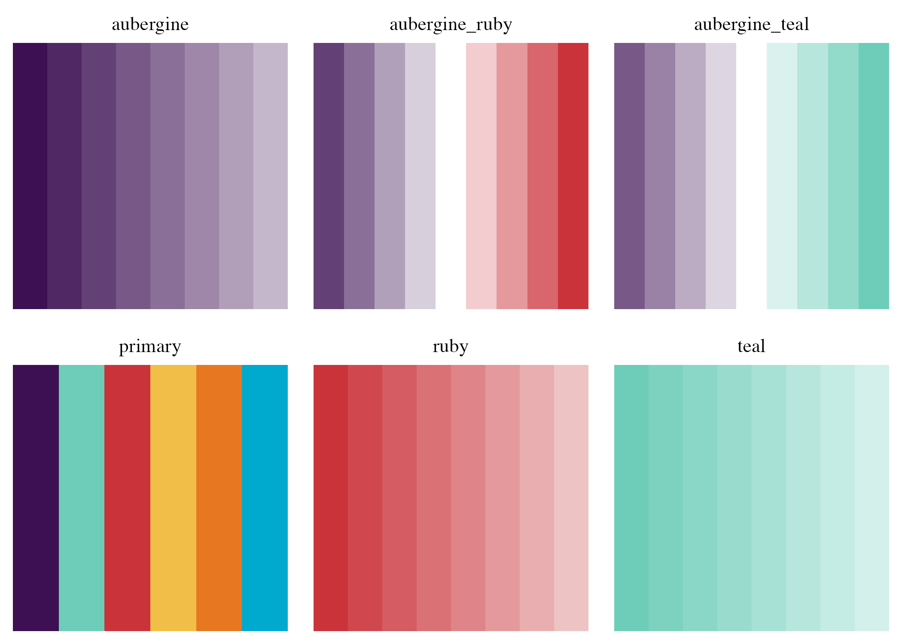
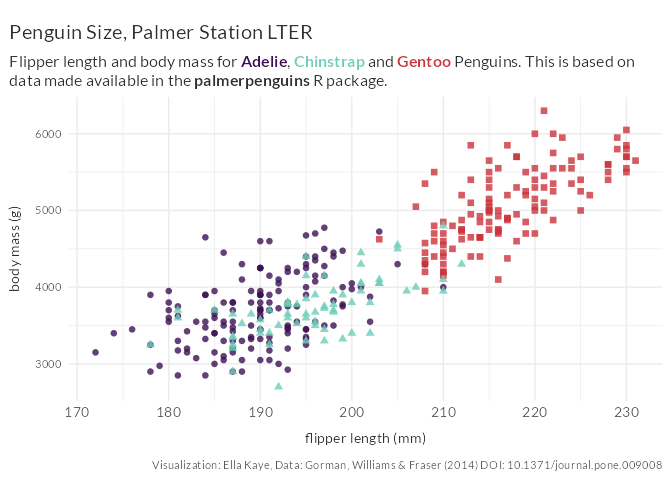

<!-- README.md is generated from README.Rmd. Please edit that file -->

# warwickplots 

<!-- badges: start -->
<!-- badges: end -->

An R package with colour palettes and a
[ggplot2](https://ggplot2.tidyverse.org) theme that are consistent with
The University of Warwick’s
[branding](https://warwick.ac.uk/about/brand/brand-guidelines/),
especially its
[colours](https://warwick.ac.uk/about/brand/brand-guidelines/colours/)
and
[typography](https://warwick.ac.uk/about/brand/brand-guidelines/typography/).

The palettes are built using the
[palettes](https://mccarthy-m-g.github.io/palettes/index.html) package.
The ggplot2 theme is heavily inspired by the work of [Cara
Thompson](https://www.cararthompson.com/), particularly this talk on
[applying a unifying aesthetic to your
plots](https://www.cararthompson.com/talks/nhsr2022-ggplot-themes/).

## Installation

You can install the development version of warwickplots from
[GitHub](https://github.com/) with:

``` r
# install.packages("remotes")
remotes::install_github("Warwick-Stats-Resources/warwickplots")
```

## Palettes

The package offers six colour palettes: one discrete, two divergent and
three sequential:

``` r
library(warwickplots)
#> Loading required package: palettes
```

``` r
plot(warwick_palettes)
```

<!-- -->

For further details on using the palettes, please see the
[warwickplots](https://warwick-stats-resources.github.io/warwickplots/articles/warwickplots.html)
vignette and the documentation for the
[palettes](https://mccarthy-m-g.github.io/palettes/index.html) package.

## `theme_warwick()`

Below is a plot that uses the `warwick_palettes::primary` palette and
`theme_warwick()`.

``` r
library(ggplot2)
library(palmerpenguins)
ggplot(penguins, aes(flipper_length_mm, body_mass_g, group = species)) +
  geom_point(aes(colour = species, shape = species), alpha = 0.8, size = 2) +
  scale_color_palette_d(warwick_palettes$primary) +
  labs(title = "Penguin Size, Palmer Station LTER",
       subtitle = "Flipper length and body mass for **<span style = 'color:#3C1053;'>Adelie</span>**, **<span style = 'color:#6DCDB8;'>Chinstrap</span>** and **<span style = 'color:#CB333B;'>Gentoo</span>** Penguins. This is based on data made available in the **palmerpenguins** R package.",
       caption = "Visualization: Ella Kaye, Data: Gorman, Williams & Fraser (2014) DOI: 10.1371/journal.pone.009008",
       x = "flipper length (mm)",
       y = "body mass (g)") +
  theme_warwick() +
  theme(legend.position = 'none')
```

<!-- -->

`theme_warwick()` is an extension of `ggplot2::theme_minimal()`,
offering the following in addition:

- Text hierarchy, with different sizes and colours
- Spacing, giving the text room to breathe
- Uses `ggtext::element_textbox_simple()` for the plot title and
  subtitle, to enable use of markdown and CSS styling, and text-wrapping
  if the title/subtitle is long
- Uses Lato or Avenir Next font (for online or print use respectively),
  *if* your system is set up for it

Note that any `theme_warwick()` defaults can be overridden with a
subsequent call to `theme()`.

For further details, including how to ensure your system is set up to
use custom fonts, see the
[warwickplots](https://warwick-stats-resources.github.io/warwickplots/articles/warwickplots.html)
vignette.
